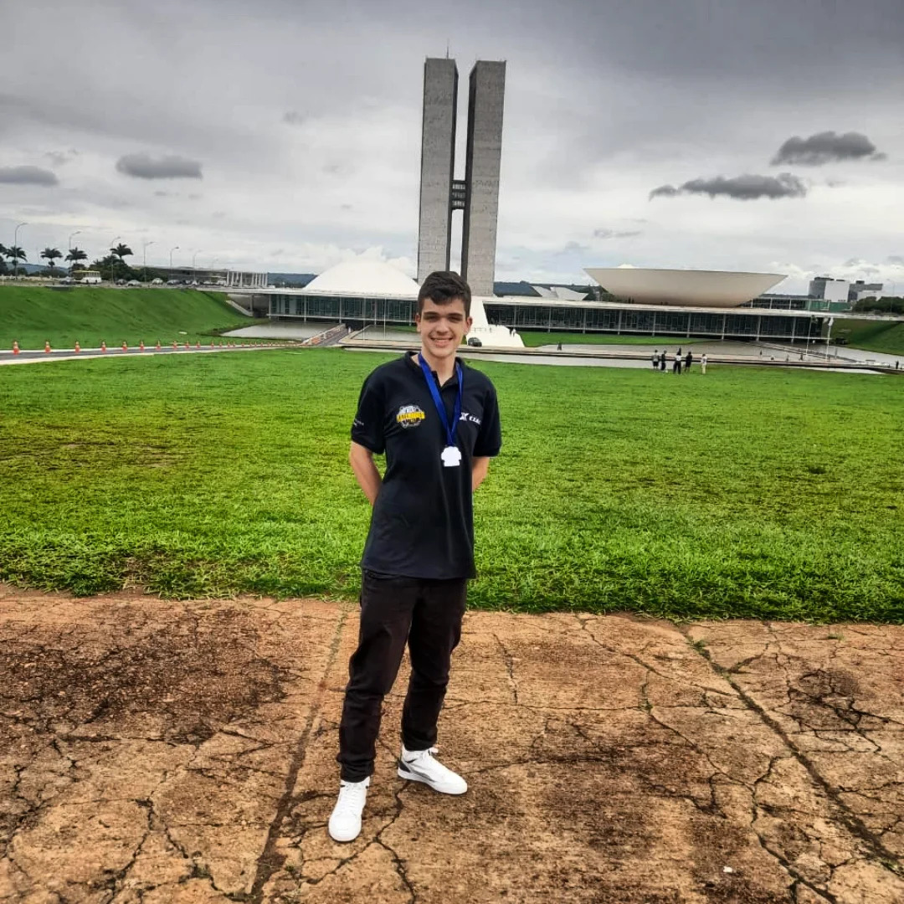

<h1 align="center">🚀 Espaço em Foco</h1>

<p align="center">
  <strong>Plataforma educacional gamificada sobre astronomia e ciências espaciais</strong>
</p>

<p align="center">
  
  
  
  
  
</p>

<p align="center">
  <a href="#-sobre-o-projeto">Sobre</a> •
  <a href="#-funcionalidades">Funcionalidades</a> •
  <a href="#-tecnologias">Tecnologias</a> •
  <a href="#-arquitetura">Arquitetura</a> •
  <a href="#-estrutura-de-pastas">Estrutura</a> •
  <a href="#-banco-de-dados">Banco de Dados</a> •
  <a href="#-como-executar">Como Executar</a> •
  <a href="#-autores">Autores</a>
</p>

---

## 📖 Sobre o Projeto

**Espaço em Foco** é uma plataforma web educacional que transforma o aprendizado sobre astronomia e ciências espaciais em uma experiência interativa e gamificada. Desenvolvida por alunos da **ETEC**, a plataforma combina conteúdo científico de qualidade com mecânicas de jogos — como sistema de XP, níveis, ranking e missões — para engajar os usuários em uma jornada de descoberta pelo universo.

O projeto nasceu da vontade de tornar a astronomia acessível e divertida, criando um ambiente onde o usuário não apenas lê sobre planetas, estrelas e galáxias, mas interage ativamente com o conteúdo, responde quizzes, acumula pontos de experiência, sobe de nível e compete com outros exploradores espaciais em um ranking global.

### 🌌 Visão Geral

A landing page pública apresenta o projeto ao visitante com seções visuais imersivas — um hero com tema espacial, cards dinâmicos de tópicos astronômicos carregados via API, uma seção "Sobre" com pilares temáticos (Exploração Cósmica, Ciência Estelar, Vida no Universo e Tecnologia Espacial), a equipe de desenvolvedores e um CTA (call-to-action) convidando o usuário a se cadastrar.

Ao criar uma conta e fazer login, o usuário é levado a um **painel personalizado** com dashboard completo: perfil com foto e banner customizáveis, barra de progresso de XP, cards de conquistas, posição no ranking, lista de artigos disponíveis, missões espaciais e a possibilidade de seguir outros usuários da comunidade.

---

## ✨ Funcionalidades

### 🔐 Autenticação & Contas
- **Cadastro completo em etapas** — registro com nome, sobrenome, email e senha, seguido de personalização de perfil (nickname + foto)
- **Login seguro** com senhas criptografadas via `password_hash()` (bcrypt)
- **Controle de sessão** — gerenciamento de sessões PHP com `session_regenerate_id()` para proteção contra session fixation
- **Recuperação de senha** — fluxo multi-etapas com verificação por código enviado ao email
- **Termos de Serviço** — modal com termos completos que o usuário deve aceitar antes do cadastro
- **Sistema de roles** — diferenciação entre usuário comum e administrador, com redirecionamentos automáticos
- **Login social** — botões preparados para integração com Google e Microsoft

### 👤 Perfil do Usuário
- **Dashboard personalizado** com foto de perfil, banner, nome completo e username
- **Upload de imagens** — foto de perfil e banner com upload para o servidor, validação de extensões e nomes únicos
- **Edição completa de perfil** — alteração de nome, sobrenome, username, email e senha, com verificação da senha atual para autorizar mudanças
- **Geração automática de nickname** — caso o usuário não defina, o sistema gera um username único baseado no nome

### 🎮 Sistema de Gamificação
- **Pontos de Experiência (XP)** — ganho de XP ao completar quizzes dos artigos corretamente
- **Sistema de Níveis** — progressão com fórmula exponencial: `XP_necessário = 500 × 1.2^(nível - 1)`
- **Barra de progresso visual** — exibição percentual do XP atual em relação ao próximo nível
- **Level Up automático** — detecção e aplicação automática de subida de nível com recálculo de XP restante
- **Cards de estatísticas** — conquistas, camada, XP atual e posição no ranking

### 🏆 Ranking & Rede Social
- **Ranking Espacial** — classificação global de usuários ordenada por nível e XP, com visualizações Top 10 e Top 50
- **Sistema de Seguidores** — follow/unfollow completo, com contagem de seguidores e seguindo
- **Modais interativos** — listas de seguidores e seguindo em modais com glassmorphism
- **Hover Card (Mini Perfil)** — ao passar o mouse sobre um username, exibe um card flutuante com avatar, nível, XP, seguidores e botão de seguir
- **Ações em tempo real** — seguir, deixar de seguir e remover seguidor com atualização instantânea via `fetch()` (sem reload)

### 📚 Conteúdo Educacional
- **Tópicos categorizados** — Planetas 🪐, Estrelas ⭐, Galáxias 🚀, Cosmologia 💥 e Outros 🔭
- **Cards de tópicos dinâmicos** — carregados via API REST do banco de dados, com imagem, título e descrição
- **Sistema de filtragem por abas** — alternância entre categorias com animações de transição
- **Barra de pesquisa** — campo de busca para encontrar tópicos rapidamente
- **Artigos completos** — páginas de artigo com conteúdo renderizado em HTML, badge de XP e navegação de retorno

### 📝 Sistema de Quizzes
- **Quizzes integrados aos artigos** — perguntas vinculadas a artigos com duas modalidades:
  - **Múltipla escolha** — alternativas exibidas em grid, com seleção via radio buttons
  - **Preenchimento de lacuna** — campo de texto embutido na frase da pergunta
- **Validação segura no backend** — respostas nunca expostas ao frontend; verificação exclusiva pelo PHP
- **Sistema de cooldown** — ao errar, o usuário deve aguardar 5 minutos antes de tentar novamente
- **Timer em tempo real** — contagem regressiva visível durante o cooldown
- **Feedback visual** — indicadores visuais de aprovado (✔ verde), reprovado (⏳ vermelho) e tentativa disponível (↻)
- **Rastreamento de progresso** — registro de cada tentativa no banco de dados com status, data e resposta dada

### 🎨 Interface & UX
- **Design espacial imersivo** — paleta de cores deep space com roxos (#04001F, #4A27C8), acentos em ciano (#00e5ff) e dourado (#FFAE00)
- **Glassmorphism** — cards com fundo translúcido e efeito de vidro
- **Animações de scroll** — elementos surgem com `fade-in-up` ao entrar no viewport via Intersection Observer
- **Responsividade** — menu hamburger para mobile, layouts adaptáveis em múltiplos breakpoints
- **Tipografia moderna** — Google Fonts Poppins com múltiplos pesos
- **CSS modular** — estilos organizados em 8+ arquivos CSS separados por componente

### 🛠️ Administração
- **Painel administrativo** — tela separada para administradores com controle de acesso baseado em roles
- **CRUD de tópicos** — formulário para adição de novos cards de tópicos com upload de imagem, título, descrição e categoria
- **Gestão de conteúdo** — inclusão de cards no banco de dados com nomes de arquivo únicos (uniqid + timestamp)

---

## 🛠️ Tecnologias

| Camada | Tecnologias |
|---|---|
| **Frontend** | HTML5, CSS3 (Vanilla, modular), JavaScript ES6+ (módulos, Fetch API, Intersection Observer) |
| **Backend** | PHP 8.x (OOP, PDO, Sessions, Password Hashing) |
| **Banco de Dados** | MySQL |
| **Servidor** | Apache com `.htaccess` para segurança e CORS |
| **Tipografia** | Google Fonts — Poppins |
| **Segurança** | bcrypt (password_hash), Prepared Statements (PDO), proteção de arquivos sensíveis via .htaccess, session_regenerate_id, validação server-side |

---

## 🏗️ Arquitetura

O projeto segue uma arquitetura **MVC simplificada** com separação clara de responsabilidades:

```
┌─────────────────────────────────────────────────────┐
│                    CLIENTE (Browser)                 │
│   HTML/CSS/JS  ←→  Fetch API  ←→  Modais/Cards     │
└──────────────────────┬──────────────────────────────┘
                       │ HTTP
┌──────────────────────▼──────────────────────────────┐
│                 SERVIDOR (Apache/PHP)                │
│                                                     │
│  ┌─────────────┐  ┌──────────────┐  ┌───────────┐  │
│  │  Páginas PHP │  │   API REST   │  │  Includes │  │
│  │  (Views)     │  │  (JSON)      │  │ (Shared)  │  │
│  │             │  │              │  │           │  │
│  │ index.php   │  │ apiCard.php  │  │ navBar    │  │
│  │ login.php   │  │ api-ranking  │  │ footer    │  │
│  │ home-user   │  │ api-follow   │  │ config    │  │
│  │ artigo.php  │  │ processa-*   │  │ functions │  │
│  └─────────────┘  └──────────────┘  └───────────┘  │
│                        │                            │
│                 ┌──────▼──────┐                     │
│                 │   PDO/MySQL │                     │
│                 └─────────────┘                     │
└─────────────────────────────────────────────────────┘
                       │
┌──────────────────────▼──────────────────────────────┐
│              BANCO DE DADOS (MySQL)                  │
│   user │ userLevel │ userPoints │ userRoles          │
│   userFollowers │ topicCards │ artigo │ quiz_*       │
│   usuario_progresso                                  │
└─────────────────────────────────────────────────────┘
```

### Fluxos Principais

**🔄 Fluxo de Autenticação:**
```
Visitante → login.php → cadastro02.php (bcrypt) → cadastro03.php (perfil)
                      → login02.php (verify) → verify-user.php (roles)
                                              → home-user.php (role=0)
                                              → home-adm.php  (role=1)
```

**📊 Fluxo de Quiz:**
```
Artigo → Quiz Form (JS) → fetch('processa-quiz.php')
                         → Valida resposta (server-side)
                         → Acertou? → +XP → Level Up? → Atualiza BD
                         → Errou?  → Cooldown 5min → Salva tentativa
```

---

## 📁 Estrutura de Pastas

```
espaco-em-foco/
│
├── 📄 index.php                    # Landing page pública (hero, tópicos, sobre, equipe)
├── 📄 config.php                   # Configuração do banco de dados (PDO) — protegido via .gitignore
├── 📄 navBar.php                   # Componente de navegação reutilizável (com foto dinâmica do usuário)
├── 📄 footer.php                   # Componente de rodapé reutilizável
├── 📄 logoff.php                   # Destruição de sessão e logout
├── 📄 adicionaCard.php             # Formulário de adição de cards de tópicos (admin)
├── 📄 adicionaCard2.php            # Processamento do formulário de cards
├── 📄 style.css                    # Arquivo CSS raiz (@import de todos os módulos)
├── 📄 .htaccess                    # Segurança Apache, cache de imagens e CORS
├── 📄 .gitignore                   # Exclusão de config.php e logs
│
├── 📂 css/                         # Folhas de estilo modulares
│   ├── global.css                  #   Reset CSS, variáveis, botões e animações globais
│   ├── header.css                  #   Estilos da barra de navegação
│   ├── hero.css                    #   Seção hero da landing page
│   ├── topics.css                  #   Cards de tópicos e sistema de abas
│   ├── about.css                   #   Seção "Sobre" da landing page
│   ├── team.css                    #   Seção de equipe com fotos
│   ├── pre-footer.css              #   CTA pré-footer
│   └── footer.css                  #   Estilos do rodapé
│
├── 📂 scripts/                     # JavaScript modular
│   ├── index.js                    #   Entry point — imports, Intersection Observer, animações
│   ├── header.js                   #   Lógica do menu hamburger responsivo
│   ├── topics.js                   #   Alternância de abas de tópicos
│   └── apiCards.js                 #   Fetch dos cards de tópicos via API REST
│
├── 📂 api/                         # Endpoints REST (retornam JSON)
│   ├── apiCard.php                 #   GET — Lista todos os cards de tópicos
│   ├── api-ranking.php             #   GET — Ranking de usuários (Top N) com posição do usuário
│   ├── api-follow-action.php       #   POST — Ações de follow/unfollow/remover seguidor
│   └── api-follow-list.php         #   GET — Lista de seguidores ou seguindo do usuário
│
├── 📂 login/                       # Sistema de autenticação
│   ├── login.php                   #   Tela de login/cadastro com transição animada (slide)
│   ├── login.js                    #   Validação client-side e lógica de transição login↔cadastro
│   ├── login.css                   #   Estilos completos da tela de autenticação
│   ├── login02.php                 #   Processamento de login (OOP: User, Auth)
│   ├── cadastro02.php              #   Processamento de cadastro (OOP: Criar) com transação
│   ├── BDconn.php                  #   Conexão legada via mysqli (backup)
│   ├── cryp2graph2.php             #   Funções auxiliares de hash SHA-256 (legado)
│   ├── verify-user.php             #   Verificação de role do usuário autenticado
│   ├── mudarsenha.php              #   Etapa 1: Solicitar reset de senha (email)
│   ├── mudarsenha02.php            #   Etapa 2: Verificar existência do email
│   ├── mudarsenha03.php            #   Etapa 3: Inserir código de verificação
│   ├── mudarsenha04.php            #   Etapa 4: Validar código
│   ├── mudarsenha05.php            #   Etapa 5: Definir nova senha
│   ├── mudarsenha06.php            #   Etapa 6: Salvar nova senha no banco
│   ├── mudarsenha.js               #   Validação JS do formulário de email
│   ├── mudarsenha.css              #   Estilos do fluxo de reset
│   ├── mudarsenha03.js             #   Validação JS do formulário de código
│   ├── mudarsenha05.js             #   Validação JS do formulário de nova senha
│   ├── 📂 finalizarCadastro/       #   Etapa final de onboarding
│   │   ├── cadastro03.php          #     Formulário de perfil (nickname + foto)
│   │   ├── cadastro03.css          #     Estilos do formulário de perfil
│   │   ├── cadastro03.js           #     Preview de imagem antes do upload
│   │   └── cadastro04.php          #     Processamento: upload de foto, nickname único
│   └── 📂 loginImg/                #   Ícones de login social
│       ├── google-icon.png
│       └── microsoft-icon.png
│
├── 📂 userScreen/                  # Área logada do usuário
│   ├── home-user.php               #   Dashboard principal (perfil, stats, artigos, missões)
│   ├── home-user.css               #   Estilos do dashboard (15.8KB)
│   ├── home-user.js                #   Lógica dos modais, ranking, hover card, ações sociais
│   ├── user-functions.php          #   Funções reutilizáveis (getUserData, getPoints, getLevel, etc.)
│   ├── calcularXp.php              #   Fórmula de XP necessário por nível
│   ├── 📂 article-screen/          #   Tela de artigo individual
│   │   ├── artigo.php              #     Artigo + Quiz (múltipla escolha ou lacuna)
│   │   ├── artigo.css              #     Estilos do artigo e quiz
│   │   ├── artigo.js               #     Submit do quiz via Fetch, timer de cooldown
│   │   └── processa-quiz.php       #     Backend: validação, XP, level up, cooldown
│   ├── 📂 edit-profile/            #   Edição de perfil
│   │   ├── editar-perfil.php       #     Formulário completo de edição
│   │   ├── editar-perfil.css       #     Estilos da tela de edição
│   │   ├── editar-perfil.js        #     Preview de imagem (avatar e banner)
│   │   └── processa-editar.php     #     Backend: validação de senha, upload, atualização
│   └── 📂 topic-screen/            #   Tela de tópico individual
│       ├── topic.php               #     Listagem de artigos do tópico com progresso
│       └── topic.css               #     Estilos da tela de tópico
│
├── 📂 admScreen/                   # Área administrativa
│   └── home-adm.php                #   Painel do administrador (com verificação de role)
│
└── 📂 img/                         # Recursos visuais
    ├── logo.jpeg                   #   Logo do projeto
    ├── ceu-estrelado.jpg           #   Background principal (céu estrelado)
    ├── planet.png                  #   Ilustração de planeta (seção sobre)
    ├── cosmic-butterfly.png        #   Nebulosa borboleta
    ├── solar-system.jpg            #   Sistema solar
    ├── user-profile-default.jpg    #   Foto de perfil padrão
    ├── rank-icon.png               #   Ícone de ranking
    ├── github-icon.png             #   Ícone do GitHub
    ├── instagram-icon.jpg          #   Ícone do Instagram
    ├── *-foto.png                  #   Fotos dos membros da equipe
    └── 📂 uploads/                 #   Uploads dos usuários
        └── 📂 profile/             #     Fotos de perfil enviadas pelos usuários
```

---

## 🎨 Design System

| Token | Valor | Uso |
|---|---|---|
| `--background-primary-color` | `#04001F` | Fundo principal (deep space) |
| `--background-secondary-color` | `#4A27C8` | Botões e acentos (roxo vibrante) |
| `--background-tertiary-color` | `#2D1B48` | Cards e elementos secundários |
| `--text-primary-color` | `#FFFFFF` | Texto principal |
| `--text-tertiary-color` | `#6200FF` | Links e destaques |
| Acento ciano | `#00e5ff` | Feedback positivo, badges de nível |
| Acento dourado | `#FFAE00` | Destaque pessoal ("Você"), ranking |
| Acento vermelho | `#ff3366` | Feedback de erro, cooldown |

---

## 👥 Autores

<table align="center">
  <tr>
    <td align="center">
      <br />
      <strong>Cauã Costa de Camargo</strong><br />
    </td>
    <td align="center">
      <br />
      <strong>Felipe Passeri Reis</strong><br />
      <a href="https://www.instagram.com/felipe.passeri/">📸 Instagram</a>
    </td>
    <td align="center">
      <br />
      <strong>Lucas Guidetti Gonzalez</strong><br />
      <a href="https://www.instagram.com/lucasguidettig/">📸 Instagram</a>
    </td>
    <td align="center">
      <br />
      <strong>Guilherme Moura Gmeiner</strong><br />
      <a href="https://www.instagram.com/gui.m.gmeiner/">📸 Instagram</a>
    </td>
  </tr>
</table>

<p align="center">
  Desenvolvido com 💜 por alunos da <strong>ETEC</strong>
</p>

---

<p align="center">
  <strong>©2026 Espaço em Foco. Todos os direitos reservados.</strong>
</p>
